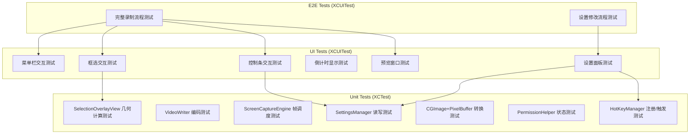
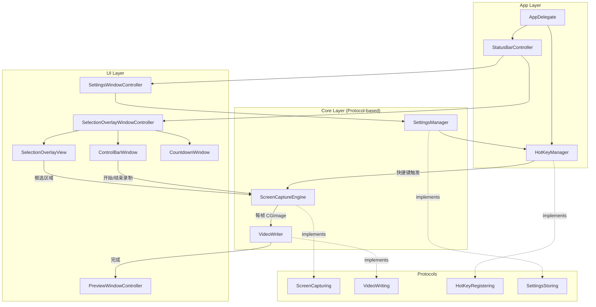

## 产品概述

一款 macOS 专属的轻量级区域录屏工具（xys-recorder），常驻系统菜单栏，支持用户自由框选屏幕任意区域进行录制，输出 MP4 格式视频。核心特点是不调用系统录屏 API（ScreenCaptureKit / AVCaptureScreenInput），避免被录屏应用检测到。采用 CGWindowListCreateImage 高频截图 + AVAssetWriter H.264 实时编码方案。

## 核心功能

### 菜单栏常驻

- APP 以 StatusBar Item 形式常驻系统菜单栏右侧，显示录屏图标
- 点击图标弹出下拉菜单：开始录像、设置、退出

### 区域框选

- 点击"开始录像"后进入框选模式：全屏半透明遮罩 + 十字光标
- 拖拽框选区域，蓝色边框 + 8 个圆形拖拽手柄（四角 + 四边中点），支持调整大小和拖拽移动
- 框选区域下方居中浮动控制条：区域尺寸 + 计时器 + 开始录制按钮

### 3 秒倒计时

- 点击"开始录制"后，框选区域中央显示倒计时动画（黑色半透明圆形 + 白色大号数字 3、2、1）

### 录制过程

- 倒计时结束后自动开始录制，帧率可选 24/30/60fps，默认 60fps
- 录制中控制条切换为：录制时长 + "结束录制"红色按钮

### 录制完成与导出

- 结束录制后弹出深色主题预览窗口：视频播放器 + 播放进度 + 导出/取消/确认按钮
- 确认后弹出 NSSavePanel 选择导出路径，输出 MP4

### 快捷键设置

- 设置面板可自定义"开始录像"和"结束录像"的全局快捷键

### 设置面板

- 默认导出路径、视频帧率（24/30/60fps）、快捷键绑定

### 自动化测试保障

- 所有核心逻辑模块配有 XCTest 单元测试
- 所有 UI 交互配有 XCUITest UI 测试
- 通过 Protocol + Mock 架构实现系统依赖的可测试性
- E2E 完整流程自动化测试覆盖

## 技术栈

- **语言**: Swift 5.9+
- **框架**: AppKit (macOS native)
- **截图引擎**: CGWindowListCreateImage / CGDisplayCreateImage（避免系统录屏 API）
- **视频编码**: AVFoundation（AVAssetWriter + AVAssetWriterInput，H.264 编码输出 MP4）
- **视频预览**: AVKit（AVPlayerView）
- **菜单栏**: NSStatusItem + NSMenu
- **全局快捷键**: NSEvent.addGlobalMonitorForEvents + addLocalMonitorForEvents
- **测试框架**: XCTest（单元测试）+ XCUITest（UI/E2E 测试）
- **构建系统**: Xcode project + Swift Package Manager
- **最低支持**: macOS 12.0+

## 实现方案

### 整体策略

采用 macOS 原生 AppKit 开发，APP 作为 LSUIElement（无 Dock 图标）运行。**全部核心模块通过 Protocol 抽象系统依赖**，使得每个模块都可以在不启动 GUI 的情况下通过 Mock 进行单元测试。UI 层通过 XCUITest 进行自动化验证。

### 可测试性架构（Protocol + Mock 模式）

这是本项目的核心设计决策。所有与系统 API 交互的模块都通过 Protocol 抽象：

1. **ScreenCapturing 协议**：抽象 `CGWindowListCreateImage`，生产环境使用真实实现，测试环境注入 MockScreenCapturer（返回预设 CGImage）
2. **VideoWriting 协议**：抽象 AVAssetWriter，测试时验证帧写入顺序、时间戳正确性，无需真实编码
3. **HotKeyRegistering 协议**：抽象全局快捷键注册，测试时模拟快捷键触发
4. **SettingsStoring 协议**：抽象 UserDefaults，测试时使用内存字典
5. **FileExporting 协议**：抽象文件保存对话框，测试时自动返回指定路径

### 核心录制原理

使用 `CGWindowListCreateImage(screenBounds, .optionOnScreenBelowWindow, kCGNullWindowID, .bestResolution)` 对指定屏幕矩形区域进行高频截图，通过 DispatchSourceTimer 精确控制帧间隔。帧率可选 24/30/60fps，默认 60fps。每帧截图转为 CVPixelBuffer 后通过 AVAssetWriter 写入 H.264 编码的 MP4 文件。

**关键优势**：CGWindowListCreateImage 不会触发 macOS 录屏指示器，不会让被录制应用通过 ScreenCaptureKit 回调检测到录制行为。

### 框选交互实现

创建全屏透明 NSWindow（level 为 .screenSaver），覆盖整个屏幕：

1. 半透明黑色遮罩覆盖全屏（30% 不透明度）
2. 框选区域通过 NSBezierPath 挖洞保持透明
3. 蓝色边框 + 8 个拖拽手柄通过 Core Graphics 绘制
4. mouseDown/mouseDragged/mouseUp 事件处理拖拽和调整

### 性能考虑

- 默认 60fps，CPU 占用约 10-20%
- CVPixelBufferPool 复用内存，避免每帧分配
- AVAssetWriter 实时编码，不需先存储图片序列
- CMTime 精确管理时间戳

## 测试策略

### 测试分层



### 各模块测试方案

| 模块 | 测试类型 | 测试内容 | Mock 依赖 |
| --- | --- | --- | --- |
| SettingsManager | XCTest | 读写帧率、路径、快捷键；默认值验证 | MockUserDefaults（内存字典） |
| VideoWriter | XCTest | 初始化、帧写入、完成回调、输出文件有效性 | 使用临时目录真实写入小视频 |
| ScreenCaptureEngine | XCTest | 帧调度频率、启停状态、delegate 回调 | MockScreenCapturer（返回1x1测试图） |
| HotKeyManager | XCTest | 快捷键注册/注销、回调触发 | MockEventMonitor |
| CGImage+PixelBuffer | XCTest | CGImage 转 CVPixelBuffer 尺寸/像素正确性 | 无，直接使用 CGContext 创建测试图 |
| PermissionHelper | XCTest | 权限状态检测返回值 | MockPermissionChecker |
| StatusBarController | XCUITest | 菜单栏图标点击、下拉菜单项显示和响应 | 无 |
| SelectionOverlayView | XCUITest + XCTest | 框选拖拽、手柄调整大小、坐标计算 | XCTest 测试几何计算逻辑 |
| ControlBarView | XCUITest | 按钮点击、状态切换（待录制/录制中） | 无 |
| CountdownView | XCUITest | 倒计时数字显示、动画完成 | 无 |
| PreviewWindow | XCUITest | 视频加载、播放控制、导出按钮 | 预置测试用 MP4 文件 |
| SettingsWindow | XCUITest | 帧率选择、路径选择、快捷键录入 | 无 |
| E2E 完整流程 | XCUITest | 菜单栏启动→框选→录制→结束→预览→导出 | 无（真实集成测试） |


### 测试基础设施

- **TestHelper**：提供创建测试用 CGImage、临时目录管理、等待异步操作的工具方法
- **MockFactory**：集中管理所有 Mock 对象的创建
- **测试用 MP4 资源**：预置一个短小的测试视频文件用于预览窗口测试

## 实现注意事项

- **权限处理**: CGPreflightScreenCaptureAccess() / CGRequestScreenCaptureAccess() 检测和请求
- **多显示器**: screenBounds 使用全局坐标系，正确处理多显示器坐标转换
- **Retina 屏幕**: .bestResolution 获取 Retina 分辨率，pixelBuffer 实际尺寸是逻辑尺寸的 2 倍
- **内存管理**: 每帧 CGImage 及时释放，CVPixelBuffer 通过 pool 管理
- **App Sandbox**: 不开启 App Sandbox（CGWindowListCreateImage 要求）
- **LSUIElement**: Info.plist 设置 LSUIElement=YES
- **XCUITest 可访问性**: 所有 UI 元素必须设置 accessibilityIdentifier，确保 XCUITest 能可靠定位

## 架构设计

### 系统架构



### 数据流

1. 用户点击菜单栏"开始录像" -> 显示 SelectionOverlayWindow
2. 用户框选区域 -> SelectionOverlayView 记录 CGRect
3. 用户点击"开始录制" -> CountdownWindow 显示 3s 倒计时
4. 倒计时结束 -> ScreenCaptureEngine 开始定时截图 -> VideoWriter 实时编码
5. 用户点击"结束录制"或按快捷键 -> ScreenCaptureEngine 停止 -> VideoWriter 完成写入
6. 弹出 PreviewWindowController -> 用户预览并选择导出路径

## 目录结构

```
xys-recorder/
├── XYSRecorder.xcodeproj/                          # [NEW] Xcode 项目配置（含 3 个 Target：App、UnitTests、UITests）
├── XYSRecorder/
│   ├── Info.plist                                   # [NEW] LSUIElement=YES，隐私权限声明
│   ├── XYSRecorder.entitlements                     # [NEW] 应用权限（无 Sandbox）
│   ├── Assets.xcassets/                             # [NEW] 应用图标 + 菜单栏图标
│   │   ├── AppIcon.appiconset/                      # [NEW] 应用图标
│   │   └── MenuBarIcon.imageset/                    # [NEW] 菜单栏 template image
│   ├── App/
│   │   ├── main.swift                               # [NEW] 应用启动入口
│   │   └── AppDelegate.swift                        # [NEW] 初始化所有管理器，权限检查，注入依赖
│   ├── Protocols/
│   │   ├── ScreenCapturing.swift                    # [NEW] 截图能力协议，定义 captureRect/startCapture/stopCapture
│   │   ├── VideoWriting.swift                       # [NEW] 视频写入协议，定义 appendFrame/finishWriting
│   │   ├── HotKeyRegistering.swift                  # [NEW] 快捷键注册协议，定义 register/unregister
│   │   └── SettingsStoring.swift                    # [NEW] 设置存储协议，定义读写帧率/路径/快捷键
│   ├── Controllers/
│   │   ├── StatusBarController.swift                # [NEW] 菜单栏控制器，NSStatusItem + NSMenu
│   │   ├── SelectionOverlayWindowController.swift   # [NEW] 框选窗口控制器，协调框选->控制条->倒计时->录制
│   │   ├── PreviewWindowController.swift            # [NEW] 深色预览窗口，AVPlayerView + 导出
│   │   └── SettingsWindowController.swift           # [NEW] 设置面板，帧率/路径/快捷键
│   ├── Views/
│   │   ├── SelectionOverlayView.swift               # [NEW] 框选视图，遮罩+边框+手柄+鼠标交互
│   │   ├── ControlBarView.swift                     # [NEW] 浮动控制条，尺寸+计时+按钮
│   │   ├── CountdownView.swift                      # [NEW] 倒计时动画视图
│   │   └── ShortcutRecorderView.swift               # [NEW] 快捷键录入控件
│   ├── Core/
│   │   ├── ScreenCaptureEngine.swift                # [NEW] 截图引擎，DispatchSourceTimer + CGWindowListCreateImage
│   │   └── VideoWriter.swift                        # [NEW] AVAssetWriter 封装，CGImage->CVPixelBuffer->H.264 MP4
│   ├── Managers/
│   │   ├── HotKeyManager.swift                      # [NEW] 全局快捷键，NSEvent 全局/本地监听
│   │   └── SettingsManager.swift                    # [NEW] UserDefaults 封装，持久化用户设置
│   └── Utils/
│       ├── CGImage+PixelBuffer.swift                # [NEW] CGImage 转 CVPixelBuffer + CVPixelBufferPool
│       └── PermissionHelper.swift                   # [NEW] 屏幕录制权限检测和引导
├── XYSRecorderTests/                                # [NEW] 单元测试 Target
│   ├── Mocks/
│   │   ├── MockScreenCapturer.swift                 # [NEW] Mock 截图实现，返回预设 CGImage
│   │   ├── MockVideoWriter.swift                    # [NEW] Mock 视频写入器，记录帧和调用
│   │   ├── MockHotKeyRegistrar.swift                # [NEW] Mock 快捷键注册器
│   │   ├── MockSettingsStore.swift                  # [NEW] Mock 设置存储（内存字典）
│   │   └── TestHelper.swift                         # [NEW] 测试工具：创建测试 CGImage、临时目录、异步等待
│   ├── SettingsManagerTests.swift                   # [NEW] 设置读写、默认值、帧率范围验证
│   ├── VideoWriterTests.swift                       # [NEW] 帧写入、时间戳、MP4 输出有效性
│   ├── ScreenCaptureEngineTests.swift               # [NEW] 帧调度频率、启停状态、回调正确性
│   ├── HotKeyManagerTests.swift                     # [NEW] 快捷键注册/注销/触发回调
│   ├── CGImagePixelBufferTests.swift                # [NEW] CGImage 转 CVPixelBuffer 尺寸和像素验证
│   └── SelectionGeometryTests.swift                 # [NEW] 框选区域几何计算、手柄命中检测
├── XYSRecorderUITests/                              # [NEW] UI 测试 Target
│   ├── Resources/
│   │   └── test_video.mp4                           # [NEW] 预置测试视频用于预览窗口测试
│   ├── StatusBarUITests.swift                       # [NEW] 菜单栏图标点击、下拉菜单项测试
│   ├── SelectionOverlayUITests.swift                # [NEW] 框选拖拽、手柄调整、遮罩显示测试
│   ├── ControlBarUITests.swift                      # [NEW] 控制条按钮点击、状态切换测试
│   ├── CountdownUITests.swift                       # [NEW] 倒计时数字显示和完成测试
│   ├── PreviewWindowUITests.swift                   # [NEW] 预览窗口加载、播放、导出按钮测试
│   ├── SettingsWindowUITests.swift                  # [NEW] 设置面板帧率选择、路径、快捷键录入测试
│   └── E2ERecordingFlowTests.swift                  # [NEW] 端到端完整录制流程测试
└── README.md                                        # [NEW] 项目说明、构建和测试指南
```

## 关键代码结构

```swift
// === 核心协议定义 ===

protocol ScreenCapturing: AnyObject {
    var captureRect: CGRect { get set }
    var frameRate: Int { get set }
    var isCapturing: Bool { get }
    var onFrameCaptured: ((CGImage, CMTime) -> Void)? { get set }
    var onError: ((Error) -> Void)? { get set }
    func startCapture()
    func stopCapture()
}

protocol VideoWriting: AnyObject {
    func startWriting(to url: URL, width: Int, height: Int, frameRate: Int) throws
    func appendFrame(_ image: CGImage, at time: CMTime) throws
    func finishWriting(completion: @escaping (Result<URL, Error>) -> Void)
}

protocol SettingsStoring: AnyObject {
    var frameRate: Int { get set }               // 24, 30, 60
    var defaultExportPath: String? { get set }
    var startRecordingShortcut: KeyCombo? { get set }
    var stopRecordingShortcut: KeyCombo? { get set }
}

protocol HotKeyRegistering: AnyObject {
    func register(shortcut: KeyCombo, action: @escaping () -> Void) -> Any?
    func unregister(_ token: Any)
}
```

## 使用的扩展

### SubAgent

- **code-explorer**
- 用途：在实现各步骤时，若需跨多文件搜索代码模式、验证依赖关系或检查已实现的模块接口一致性时使用
- 预期效果：确保各模块之间的 Protocol 接口、Mock 实现和真实实现保持一致