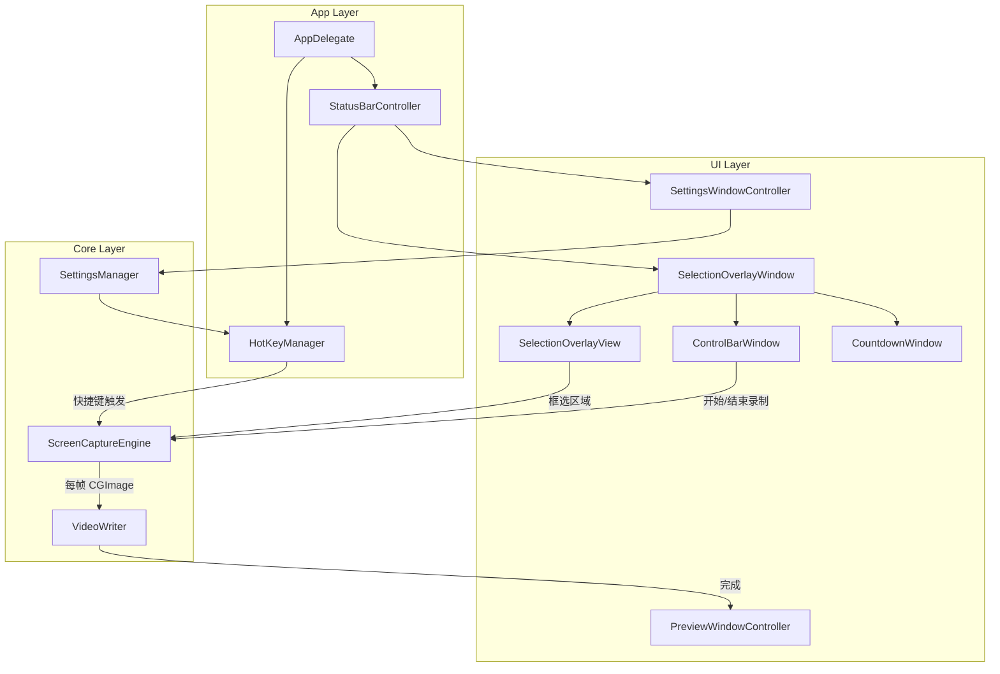

## Product Overview

一款 macOS 专属的轻量级区域录屏工具（xys-recorder），常驻系统菜单栏，支持用户自由框选屏幕任意区域进行录制，输出 MP4 格式视频。核心特点是不调用系统录屏 API，避免被录屏应用检测到。

## Core Features

### 菜单栏常驻

- APP 以 StatusBar Item 形式常驻系统菜单栏右侧，显示一个录屏图标
- 点击图标弹出下拉菜单，包含"开始录像"、"设置"、"退出"等选项

### 区域框选

- 点击"开始录像"后，屏幕进入框选模式：覆盖一层半透明遮罩，鼠标变为十字光标
- 用户拖拽鼠标框选录屏区域，框选区域显示蓝色边框 + 8 个圆形拖拽手柄（四角 + 四边中点），可调整大小和位置
- 框选区域右下方出现浮动控制条，显示区域尺寸（如 529x281）、计时器（00:00）和"开始录制"蓝色按钮

### 倒计时

- 点击"开始录制"后，框选区域中央出现 3 秒倒计时动画（黑色半透明圆形背景 + 白色大号数字 3、2、1）

### 录制过程

- 倒计时结束后自动开始录制框选区域内容
- 使用 CGWindowListCreateImage 对指定区域高频截图（可选 24/30/60fps，默认 60fps），不触发系统录屏指示器
- 录制中，控制条变为：录制时长计时器 + "结束录制"红色按钮
- 框选边框在录制期间保持显示

### 录制完成与导出

- 结束录制后弹出预览窗口（深色主题），包含：视频预览播放器、播放进度条、清晰度选项、下载/导出按钮、取消和确认按钮
- 确认后弹出系统文件保存对话框，用户选择导出路径，输出 MP4 格式

### 快捷键设置

- 设置面板中可自定义"开始录像"和"结束录像"的全局快捷键
- 快捷键全局生效，无需 APP 处于前台

### 设置面板

- 支持设置默认导出路径、视频帧率、快捷键绑定等

## Tech Stack

- **语言**: Swift 5.9+
- **框架**: AppKit (macOS native)
- **截图引擎**: CGWindowListCreateImage / CGDisplayCreateImage（避免系统录屏 API）
- **视频编码**: AVFoundation（AVAssetWriter + AVAssetWriterInput，H.264 编码输出 MP4）
- **视频预览**: AVKit（AVPlayerView）
- **菜单栏**: NSStatusItem + NSMenu
- **全局快捷键**: Carbon HotKey API（CGEvent tap 或 NSEvent.addGlobalMonitorForEvents）
- **构建系统**: Swift Package Manager + Xcode project
- **最低支持**: macOS 12.0+

## Implementation Approach

### 整体策略

采用 macOS 原生 AppKit 开发，不使用 Electron/SwiftUI 以保证性能和系统集成度。APP 作为 LSUIElement（无 Dock 图标）运行，仅在菜单栏显示。

### 核心录制原理

使用 `CGWindowListCreateImage(screenBounds, .optionOnScreenBelowWindow, kCGNullWindowID, .bestResolution)` 对指定屏幕矩形区域进行高频截图，通过 DispatchSourceTimer 精确控制帧间隔。帧率可在设置中调节（可选 24/30/60fps，默认 60fps），以满足录制视频内容的流畅度需求。每帧截图转为 CVPixelBuffer 后通过 AVAssetWriter 写入 H.264 编码的 MP4 文件。

**关键优势**：CGWindowListCreateImage 不会触发 macOS 的录屏指示器（橙色/紫色圆点），也不会让被录制应用通过 ScreenCaptureKit 回调检测到录制行为。仍需用户在系统偏好设置中授予"屏幕录制"权限。

### 框选交互实现

创建一个全屏透明 NSWindow（level 为 .screenSaver），覆盖整个屏幕。窗口内使用自定义 NSView 绘制：

1. 半透明黑色遮罩覆盖全屏
2. 框选区域保持透明（通过 NSBezierPath 挖洞）
3. 蓝色边框 + 8 个拖拽手柄通过 Core Graphics 绘制
4. 手柄拖拽通过 mouseDown/mouseDragged/mouseUp 事件处理

### 性能考虑

- 默认 60fps 截图 + H.264 编码，支持 24/30/60fps 可选，CPU 占用约 10-20%
- 使用 CVPixelBufferPool 复用内存，避免每帧分配
- AVAssetWriter 实时编码，不需要先存储图片序列再转换
- 时间戳使用 CMTime 精确管理，确保视频播放流畅

## Implementation Notes

- **权限处理**: 首次启动需引导用户开启"屏幕录制"权限，可通过 CGPreflightScreenCaptureAccess() / CGRequestScreenCaptureAccess() 检测和请求
- **多显示器**: CGWindowListCreateImage 的 screenBounds 使用全局坐标系，需正确处理多显示器场景下的坐标转换
- **Retina 屏幕**: 截图时使用 .bestResolution 选项获取 Retina 分辨率，但写入视频时需注意 pixelBuffer 的实际尺寸是逻辑尺寸的 2 倍
- **内存管理**: 每帧 CGImage 使用后需及时释放，CVPixelBuffer 通过 pool 管理
- **App Sandbox**: 由于使用 CGWindowListCreateImage，此 APP 不能开启 App Sandbox（无法上架 Mac App Store，但满足用户需求）
- **LSUIElement**: 在 Info.plist 中设置 LSUIElement=YES，使 APP 不在 Dock 显示

## Architecture Design

### 系统架构



### 模块职责

- **AppDelegate**: 应用入口，初始化各管理器，处理权限检查
- **StatusBarController**: 管理菜单栏图标和下拉菜单
- **SelectionOverlayWindow/View**: 全屏覆盖窗口，处理框选交互、绘制遮罩/边框/手柄
- **ControlBarWindow**: 浮动控制条窗口，显示尺寸/计时/按钮
- **CountdownWindow**: 倒计时动画窗口
- **ScreenCaptureEngine**: 核心截图引擎，使用 DispatchSourceTimer 驱动 CGWindowListCreateImage
- **VideoWriter**: 封装 AVAssetWriter，负责将 CGImage 序列编码为 MP4
- **PreviewWindowController**: 录制完成后的视频预览和导出
- **SettingsWindowController**: 设置面板（快捷键、默认路径、帧率）
- **SettingsManager**: UserDefaults 封装，持久化用户设置
- **HotKeyManager**: 全局快捷键注册和回调管理

### 数据流

1. 用户点击菜单栏"开始录像" -> 显示 SelectionOverlayWindow
2. 用户框选区域 -> SelectionOverlayView 记录 CGRect
3. 用户点击"开始录制" -> CountdownWindow 显示 3s 倒计时
4. 倒计时结束 -> ScreenCaptureEngine 开始定时截图 -> VideoWriter 实时编码
5. 用户点击"结束录制"或按快捷键 -> ScreenCaptureEngine 停止 -> VideoWriter 完成写入
6. 弹出 PreviewWindowController -> 用户预览并选择导出路径

## Directory Structure

```
xys-recorder/
├── XYSRecorder.xcodeproj/              # [NEW] Xcode 项目配置文件
├── XYSRecorder/
│   ├── Info.plist                       # [NEW] 应用配置，设置 LSUIElement=YES，权限声明等
│   ├── XYSRecorder.entitlements         # [NEW] 应用权限配置
│   ├── Assets.xcassets/                 # [NEW] 应用图标和菜单栏图标资源
│   │   ├── AppIcon.appiconset/          # [NEW] 应用图标
│   │   └── MenuBarIcon.imageset/        # [NEW] 菜单栏图标（template image）
│   ├── App/
│   │   ├── AppDelegate.swift            # [NEW] 应用入口。初始化 StatusBarController、HotKeyManager、SettingsManager，检查屏幕录制权限，管理应用生命周期
│   │   └── main.swift                   # [NEW] 应用启动入口点
│   ├── Controllers/
│   │   ├── StatusBarController.swift    # [NEW] 菜单栏控制器。创建 NSStatusItem，配置下拉菜单（开始录像、设置、退出），协调框选流程启动
│   │   ├── SelectionOverlayWindowController.swift  # [NEW] 框选覆盖窗口控制器。管理全屏透明窗口的生命周期，协调框选完成后的控制条显示、倒计时和录制启动
│   │   ├── PreviewWindowController.swift  # [NEW] 预览窗口控制器。深色主题窗口，内嵌 AVPlayerView 播放录制视频，提供导出/取消操作，调用 NSSavePanel 选择保存路径
│   │   └── SettingsWindowController.swift # [NEW] 设置窗口控制器。提供快捷键录入、默认导出路径选择、帧率设置的 UI 界面
│   ├── Views/
│   │   ├── SelectionOverlayView.swift   # [NEW] 框选覆盖视图。绘制半透明遮罩、框选区域蓝色边框、8个拖拽手柄，处理 mouseDown/mouseDragged/mouseUp 交互逻辑，支持区域调整
│   │   ├── ControlBarView.swift         # [NEW] 浮动控制条视图。显示区域尺寸信息、录制计时器、开始/结束录制按钮，根据录制状态切换 UI
│   │   ├── CountdownView.swift          # [NEW] 倒计时视图。黑色半透明圆形背景 + 白色大号数字动画（3、2、1），支持缩放和淡出动画
│   │   └── ShortcutRecorderView.swift   # [NEW] 快捷键录入控件。监听键盘输入，显示快捷键组合文本
│   ├── Core/
│   │   ├── ScreenCaptureEngine.swift    # [NEW] 截图引擎。使用 DispatchSourceTimer 以 30fps 调用 CGWindowListCreateImage 截取指定区域，通过 delegate/callback 传递每帧 CGImage 给 VideoWriter
│   │   └── VideoWriter.swift            # [NEW] 视频写入器。封装 AVAssetWriter + AVAssetWriterInput，管理 CVPixelBufferPool，将 CGImage 转为 CVPixelBuffer 并实时编码为 H.264 MP4，处理时间戳管理和文件完成回调
│   ├── Managers/
│   │   ├── HotKeyManager.swift          # [NEW] 全局快捷键管理器。使用 NSEvent.addGlobalMonitorForEvents 和 addLocalMonitorForEvents 注册/注销全局快捷键，触发开始/结束录制回调
│   │   └── SettingsManager.swift        # [NEW] 设置管理器。基于 UserDefaults 封装，持久化存储快捷键配置、默认导出路径、帧率等用户偏好设置
│   └── Utils/
│       ├── CGImage+PixelBuffer.swift    # [NEW] CGImage 扩展。提供 CGImage 转 CVPixelBuffer 的便捷方法，使用 CVPixelBufferPool 优化内存分配
│       └── PermissionHelper.swift       # [NEW] 权限辅助工具。封装 CGPreflightScreenCaptureAccess/CGRequestScreenCaptureAccess，提供权限检查和引导用户开启权限的逻辑
└── README.md                            # [NEW] 项目说明文档
```

## Key Code Structures

```swift
// ScreenCaptureEngine 核心接口
protocol ScreenCaptureEngineDelegate: AnyObject {
    func captureEngine(_ engine: ScreenCaptureEngine, didCaptureFrame image: CGImage, at time: CMTime)
    func captureEngine(_ engine: ScreenCaptureEngine, didFailWithError error: Error)
}

class ScreenCaptureEngine {
    weak var delegate: ScreenCaptureEngineDelegate?
    var captureRect: CGRect  // 屏幕坐标系下的截图区域
    var frameRate: Int       // 帧率，可选 24/30/60，默认 60
    
    func startCapture()
    func stopCapture()
    var isCapturing: Bool { get }
}

// VideoWriter 核心接口
class VideoWriter {
    init(outputURL: URL, width: Int, height: Int, frameRate: Int) throws
    func appendFrame(_ image: CGImage, at time: CMTime) throws
    func finishWriting(completion: @escaping (Result<URL, Error>) -> Void)
}
```

## Design Style

本应用为 macOS 原生 AppKit 应用，不使用 Web 技术，但以下描述指导 UI 的视觉设计方向。

### 整体风格

采用 macOS 原生风格，融合现代简约设计。遵循 Apple HIG 规范，使用系统原生控件和动效，确保与 macOS 系统 UI 无缝融合。

### 页面设计

#### 1. 框选模式界面

- **遮罩层**: 全屏半透明黑色遮罩（约 30% 不透明度），框选区域保持完全透明
- **框选边框**: 1.5px 浅蓝色实线边框，颜色接近系统选择蓝（#007AFF），四角和四边中点各有一个 8px 白色圆形拖拽手柄，手柄带 1px 蓝色描边
- **尺寸标注**: 框选区域左上角附近显示区域尺寸（如 "529 x 281"），白色文字带半透明黑色背景圆角标签
- **十字光标**: 框选开始前鼠标显示为精确十字光标

#### 2. 浮动控制条

- **位置**: 固定在框选区域下方居中，与框选区域底边间距 12px
- **外观**: 白色圆角矩形（圆角 8px），带轻微阴影（macOS 原生窗口阴影风格），高度约 40px
- **待录制状态**: 左侧显示 "00:00" 灰色计时文字 | 右侧显示"开始录制"蓝色圆角按钮（背景色 #007AFF，白色文字）
- **录制中状态**: 左侧显示录制时长"00:01"深色文字 | 右侧显示"结束录制"红色圆角按钮（背景色 #FF3B30，白色文字）
- **悬浮动效**: 按钮 hover 时轻微加深背景色

#### 3. 倒计时动画

- **位置**: 框选区域正中央
- **外观**: 120px 直径的黑色半透明圆形（70% 不透明度），内显示白色粗体大号数字（约 64px，SF Pro Display Bold）
- **动画**: 每秒数字切换，伴随轻微缩放弹性动画（从 1.2x 缩小到 1.0x）和淡入效果

#### 4. 预览窗口

- **整体**: 深色主题窗口（背景色 #1E1E1E），标准 macOS 窗口样式（红绿灯按钮），标题显示 "XYS Recorder"
- **视频区域**: 窗口上部占主要空间，显示录制的视频预览，保持原始宽高比，四周留适当内边距
- **底部工具栏**: 深色背景（#2A2A2A），包含：
- 左侧：播放/暂停按钮 + 进度条 + 时间显示（00:00/00:03）
- 右侧：清晰度下拉选择（"高清"）、下载导出按钮（下箭头图标）、取消按钮（X 图标）、确认按钮（勾号图标）

#### 5. 设置面板

- 标准 macOS 偏好设置窗口风格，浅色背景
- 分组表单布局：快捷键设置区、导出路径设置区、帧率选择区
- 使用系统原生控件（NSTextField、NSPopUpButton、NSPathControl）