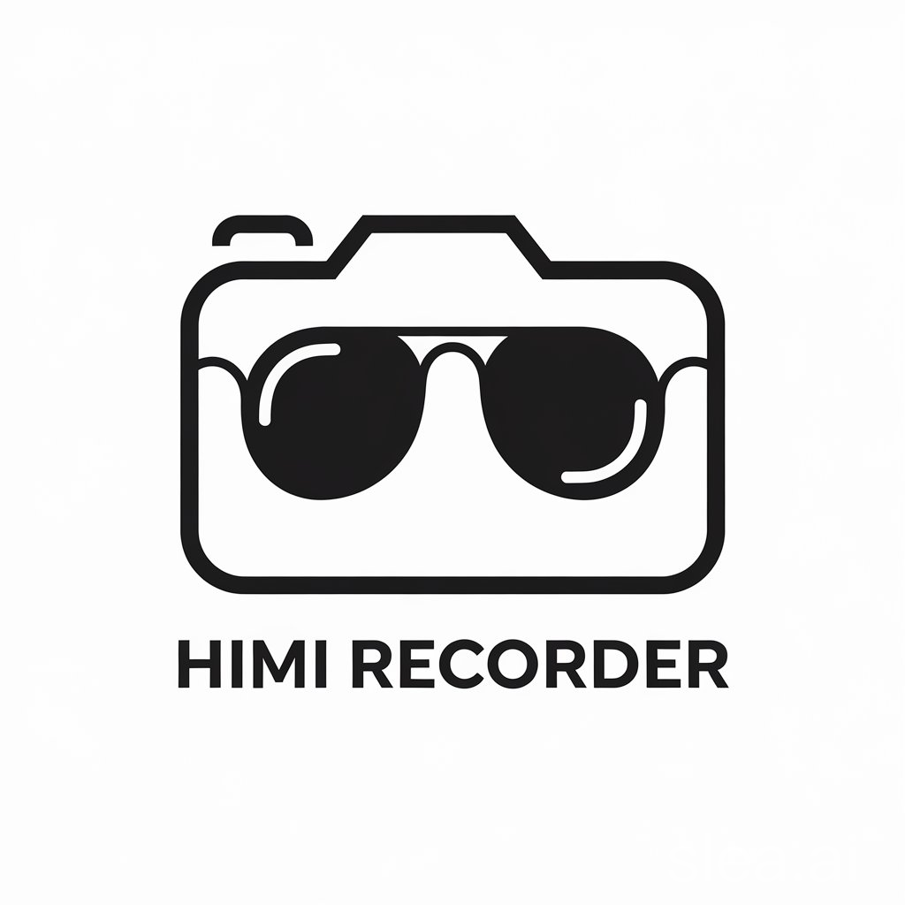
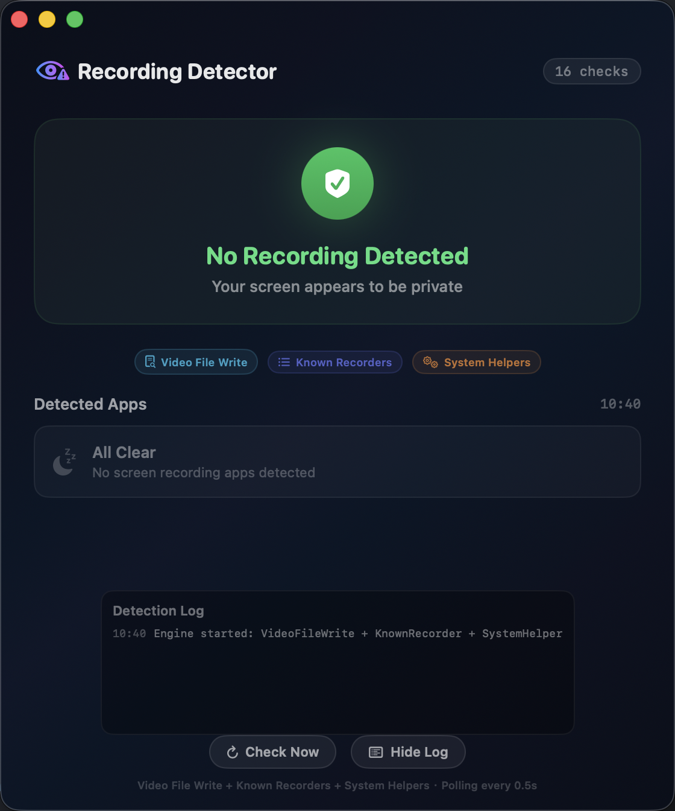
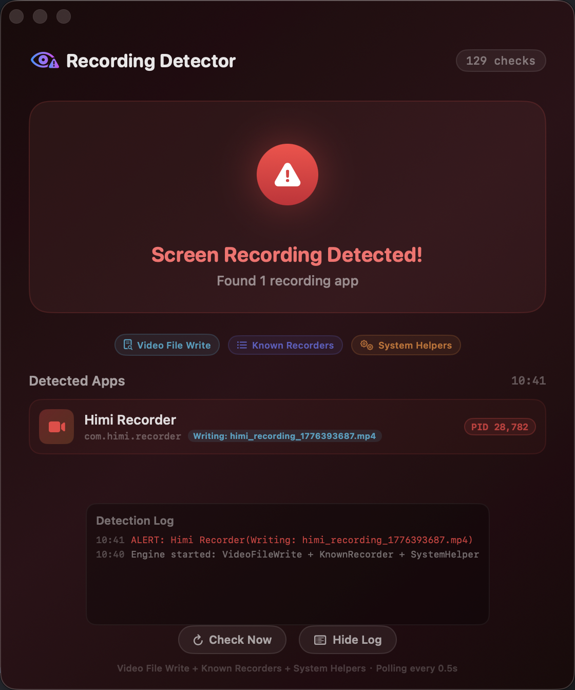

<p align="center">
  
</p>

<h1 align="center">Himi Recorder</h1>

<p align="center">一款具有隐身能力的 macOS 录屏工具 —— 绕过系统录屏检测机制，让被录制的应用无法感知正在被录屏。常驻菜单栏，框选任意区域，录制为 MP4。</p>

## 演示


https://github.com/user-attachments/assets/22803ddf-d6dd-4332-963b-76b792cde45e


## 核心原理

### 为什么不用系统录屏 API？

macOS 传统的录屏方案（如 `AVCaptureScreenInput`）会触发系统级的录屏指示器，让被录制的应用能够检测到正在被录屏。Himi Recorder 使用 **ScreenCaptureKit** 的 `SCStream` API，以排除自身窗口的方式进行屏幕捕获，录制内容不包含应用自身的 UI 元素（控制条、边框等）。

### 反检测机制

常见的录屏检测手段是扫描所有进程的文件描述符（`proc_pidfdinfo`），检查是否有进程正在写入 `.mp4`/`.mov` 等视频文件。Himi Recorder 通过以下策略规避：

- **伪装文件扩展名**: 录制过程中使用 `.tmp` 后缀写入临时文件，`AVAssetWriter` 的容器格式由 `fileType` 参数决定，不依赖文件扩展名
- **延迟重命名**: 录制完成后（`finishWriting` 回调后）才将 `.tmp` 重命名为 `.mp4`，确保活跃写入期间不暴露视频文件特征

### 技术架构

```
┌─────────────────────────────────────────────────┐
│                  AppDelegate                     │
│  (录制流程协调：框选 → 倒计时 → 录制 → 预览)       │
├──────────┬──────────┬───────────┬────────────────┤
│StatusBar │Selection │ControlBar │  Preview       │
│Controller│ Overlay  │  Window   │  Window        │
├──────────┴──────────┴───────────┴────────────────┤
│           ScreenCaptureEngine (SCStream)          │
│  ┌─────────────────────────────────────────────┐  │
│  │ SCShareableContent → SCContentFilter        │  │
│  │ → SCStream + SCStreamOutput                 │  │
│  │ → CMSampleBuffer → CGImage                  │  │
│  └─────────────────────────────────────────────┘  │
├──────────────────────────────────────────────────┤
│           VideoWriter (AVAssetWriter)             │
│  CGImage → CVPixelBuffer → H.264 → MP4           │
└──────────────────────────────────────────────────┘
```

- **ScreenCaptureKit (`SCStream`)**: 以流的方式捕获指定屏幕区域，通过 `sourceRect` 只截取框选范围，帧率可配（24/30/60fps）
- **AVAssetWriter**: 实时将每帧 `CGImage` 转为 `CVPixelBuffer`，编码为 H.264 写入 MP4
- **多屏幕支持**: 在所有屏幕上显示框选遮罩，自动检测框选区域所在的显示器
- **坐标系处理**: NSScreen（左下原点）↔ CG/Quartz（左上原点）自动转换

## 功能特性

- **菜单栏常驻**: 轻量后台运行，不占 Dock 位置
- **任意区域框选**: 支持多屏幕，可拖拽调整框选范围（8 个手柄）
- **3 秒倒计时**: 录制前倒计时，居中显示在框选区域
- **录制时长显示**: 控制条实时显示录制时长 + 闪烁红点
- **视频预览编辑**:
  - 速度调节：0.5x / 1x / 1.5x / 2x / 2.5x / 3x / 3.5x / 4x
  - QuickTime 风格裁剪条：拖拽首尾手柄截取片段
- **导出方式**:
  - 「导出」按钮：选择路径保存 MP4 到本地
  - 「✓」按钮：复制到系统剪贴板，可直接粘贴到微信等 IM 发送
- **快捷键支持**: 可自定义开始/结束录制的全局快捷键
- **ESC 一键取消**: 在框选、倒计时或录制过程中，随时按 ESC 取消整个录制流程
- **帧率可选**: 24 / 30 / 60 fps，默认 60fps

## 系统要求

- **macOS 14.0 (Sonoma)** 或更高版本
- 需要授予「屏幕录制」权限

## 快速开始

### 1. 克隆并构建

```bash
git clone <repo-url> himi-recorder
cd himi-recorder
./build.sh
```

### 2. 首次运行

```bash
open HimiRecorder.app
```

首次启动时，系统会请求屏幕录制权限：
1. 点击「打开系统设置」
2. 在「隐私与安全性 → 屏幕录制」中打开 Himi Recorder 的开关
3. 重新启动应用

### 3. 使用方法

1. 点击菜单栏图标 → 「开始录制」
2. 在任意屏幕上**框选**需要录制的区域（可拖拽手柄调整）
3. 点击控制条上的**「开始录制」**按钮（按 **ESC** 可随时取消）
4. 等待 **3 秒倒计时**
5. 录制进行中，控制条显示时长
6. 点击**「结束录制」**（或按 **ESC** 取消并丢弃录制）
7. 在预览窗口中：
   - 调整播放速度
   - 拖拽裁剪条截取片段
   - 点击「导出」保存到本地，或点击「✓」复制到剪贴板

## 项目结构

```
himi-recorder/
├── Package.swift                 # SPM 包配置
├── build.sh                      # 一键构建脚本
├── HimiRecorder/
│   ├── App/
│   │   ├── main.swift            # 应用入口
│   │   └── AppDelegate.swift     # 录制流程协调
│   ├── Protocols/                # 可测试性协议抽象
│   │   ├── ScreenCapturing.swift
│   │   ├── VideoWriting.swift
│   │   ├── SettingsStoring.swift
│   │   └── HotKeyRegistering.swift
│   ├── Core/
│   │   ├── ScreenCaptureEngine.swift  # SCStream 截图引擎
│   │   └── VideoWriter.swift          # AVAssetWriter 视频编码
│   ├── Controllers/
│   │   ├── StatusBarController.swift
│   │   ├── SelectionOverlayWindowController.swift
│   │   ├── PreviewWindowController.swift
│   │   └── SettingsWindowController.swift
│   ├── Views/
│   │   ├── SelectionOverlayView.swift
│   │   ├── ControlBarView.swift
│   │   ├── CountdownView.swift
│   │   └── ShortcutRecorderView.swift
│   ├── Managers/
│   │   ├── SettingsManager.swift
│   │   └── HotKeyManager.swift
│   └── Utils/
│       ├── CGImage+PixelBuffer.swift
│       └── PermissionHelper.swift
├── HimiRecorderTests/            # 100+ 单元测试
│   ├── SettingsManagerTests.swift
│   ├── SelectionGeometryTests.swift
│   ├── ControlBarTests.swift
│   ├── ScreenCaptureEngineTests.swift
│   ├── VideoWriterTests.swift
│   ├── HotKeyManagerTests.swift
│   ├── CGImagePixelBufferTests.swift
│   ├── E2ERecordingFlowTests.swift
│   └── Mocks/
├── DetectorTestApp/              # 录屏检测测试工具 (详见 DetectorTestApp/README.md)
└── HimiRecorder.app/             # 构建产物
```

## Recording Detector — 隐身效果测试工具

项目附带一个独立的测试 APP [Recording Detector](DetectorTestApp/README.md)，用于验证 Himi Recorder 的隐身能力。它通过 `proc_pidfdinfo` 扫描所有进程的文件描述符，检测是否有进程正在写入视频文件（`.mp4`/`.mov` 等），能够检测到 QQ、OBS 等常见录屏软件。

Himi Recorder 的规避策略：录制期间使用 `.tmp` 后缀写入临时文件，录制完成后才重命名为 `.mp4`，因此在录制过程中不会被视频文件写入检测捕获。

<p align="center">
  
  
</p>

```bash
cd DetectorTestApp && ./build.sh && open DetectorTestApp.app
```

> 详细说明见 [DetectorTestApp/README.md](DetectorTestApp/README.md)

## 开发

```bash
# 构建
swift build

# 运行测试
swift test

# Release 构建 + 打包 APP
./build.sh
```

## 许可证

MIT License

## 免责声明

本项目仅供技术学习与交流使用，旨在探索 macOS 屏幕捕获与反检测的技术实现。

**严禁**将本软件用于以下行为：

- 未经他人同意录制其屏幕内容，侵犯他人隐私权
- 盗录影视、游戏、直播等受著作权法保护的内容
- 规避数字版权保护（DRM）措施，进行盗版传播
- 任何违反《中华人民共和国著作权法》《中华人民共和国个人信息保护法》《中华人民共和国网络安全法》及其他适用法律法规的行为

使用者应自行确保其使用行为合法合规，并对使用本软件产生的一切后果承担全部法律责任。本项目作者不对任何因使用或滥用本软件而导致的直接或间接损失、法律纠纷承担任何责任。

**下载、安装或使用本软件即表示您已阅读并同意上述声明。**
